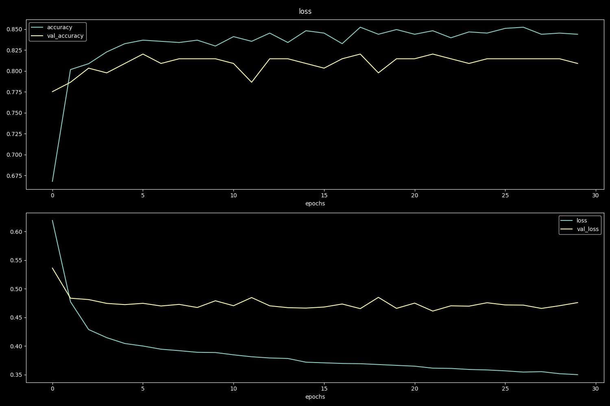
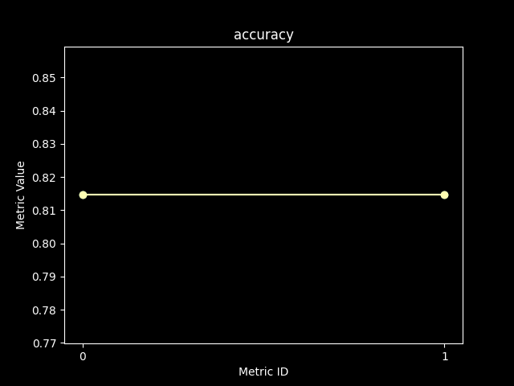

# Report
This is the automated report for the 
model  created using **Mainera**.  
It provides a comprehensive overview of the model’s performance, including::  
- Performance Summary — Highlighting key evaluation metrics and model results
- Training Graphs — Visualizing deep learning history (loss, accuracy, and other tracked metrics) if exists
## Model History

## Metrics Summary
- Each metric is displayed with its user-defined name, unique identifier (ID) and the corresponding results.
- Depending on the metric type, the results may include scalar values, arrays, dictionaries,strings, curves, or tuples.
- All metrics are presented in a structured and consistent format to facilitate clear interpretation and comparison.

### Metric name: accuracy

Table 
<table border="1" class="dataframe">
  <thead>
    <tr style="text-align: right;">
      <th></th>
      <th>0</th>
      <th>1</th>
    </tr>
  </thead>
  <tbody>
    <tr>
      <th>Metric ID</th>
      <td>0</td>
      <td>1</td>
    </tr>
    <tr>
      <th>Metric Value</th>
      <td>0.814607</td>
      <td>0.814607</td>
    </tr>
  </tbody>
</table>

Graph 

